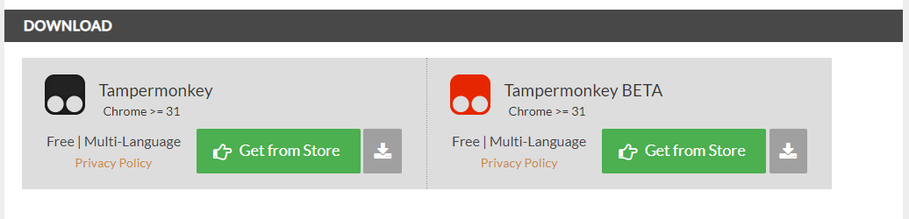

# Overlay for r/place

After installation, you will see smaller pixels on the canvas. Those indicate which color the real ones should have

# Install overlay

1. Open https://www.tampermonkey.net/
   
   

2. In the download section, you'll want to click on the green "Get from store" button
   
   

3. Now you need to click on this link: https://github.com/aweissoertel/place-overlay/raw/main/src/scripts/placeDE-overlay.user.js. Tampermonkey should recognize the script.
   
   
   
4. Update or reinstall the script
   
   

# How does the overlay work?
After installation, you will see smaller pixels on the canvas. Those indicate which color the real ones should have

# FAQ

## Why is it not working?
- Try reloading
- Zoom into the coordinates of your images, the subpixels of the overlay are very small!
- Try another browser maybe
